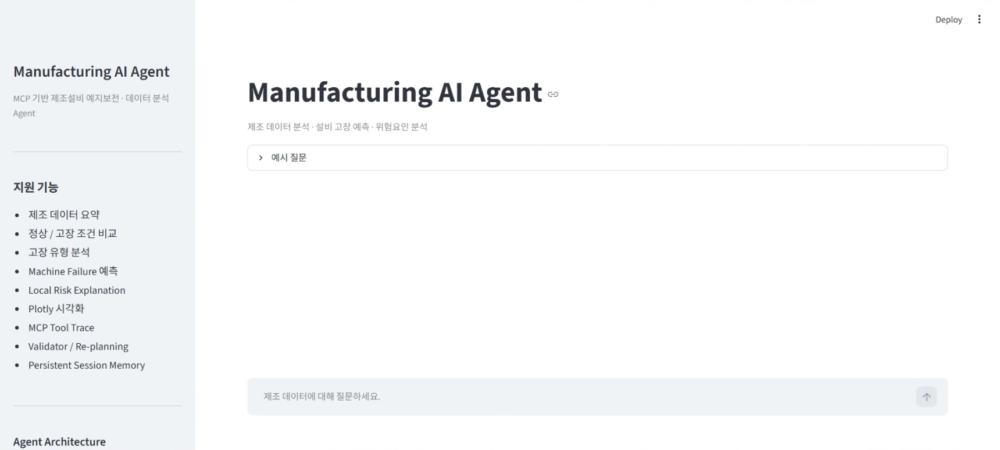
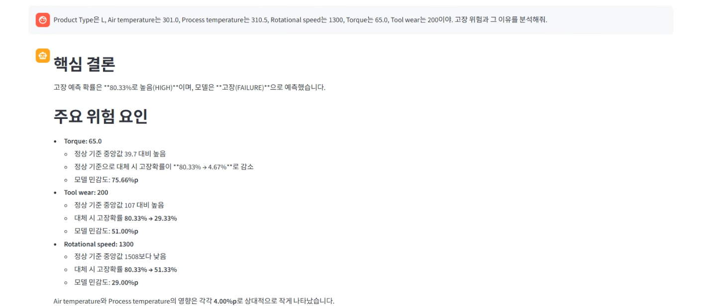
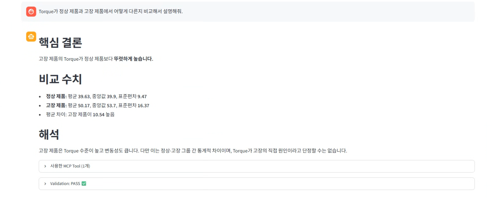
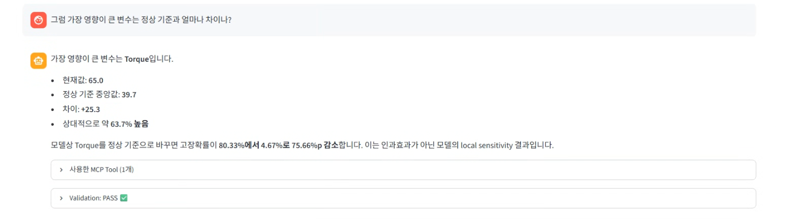
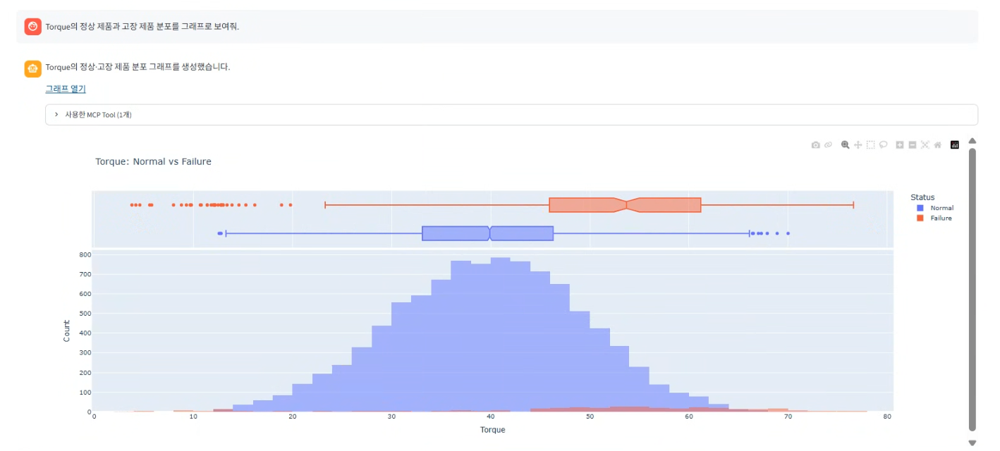
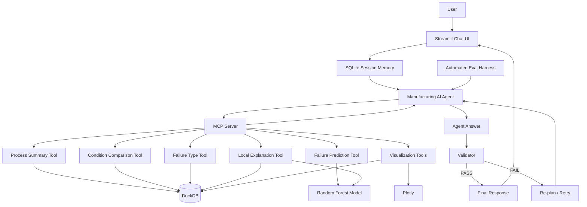

# Manufacturing AI Agent

> **MCP-based AI Agent for Manufacturing Predictive Maintenance & Failure Analysis**

**Python 3.12 · OpenAI Agents SDK · MCP · DuckDB · Random Forest · Streamlit**

제조 데이터를 자연어로 분석하고, 설비 고장 위험을 예측하며,
예측 근거를 분석·시각화하는 Tool-using Manufacturing AI Agent입니다.

단순 LLM 질의응답을 넘어 **MCP Tool Calling, Persistent Session Memory,
Validator/Re-planning, Automated Evaluation**을 적용하여
Agent의 실행 과정과 답변 신뢰성을 검증할 수 있도록 설계했습니다.

---

## 1. Project Overview

제조 현장에서 데이터 분석을 수행하려면 일반적으로 다음과 같은 작업이 필요합니다.

- 공정 데이터 조회
- 정상 / 고장 조건 비교
- 설비 고장 위험 예측
- 위험요인 분석
- 시각화
- 분석 결과 검증

본 프로젝트는 이러한 기능을 Python 기반 분석 모듈로 구현한 뒤,
**MCP(Model Context Protocol)** 를 통해 LLM Agent가 사용할 수 있는 Tool로 제공합니다.

사용자는 SQL이나 Python 코드를 직접 작성하지 않고
자연어만으로 제조 데이터를 분석할 수 있습니다.

예를 들어:

```text
User
Product Type L의 전체 샘플 수와 고장률을 알려줘.

Agent
전체 샘플 수: 6,000건
고장 건수: 235건
고장률: 3.92%
```

특정 제조조건을 입력하면 실제 Machine Learning Model을 호출해
고장 위험을 예측할 수도 있습니다.

```text
User
Type L이고 Air temperature 301,
Process temperature 310.5,
Rotational speed 1300,
Torque 65,
Tool wear 200일 때 고장 위험을 분석해줘.

Agent
Failure Probability: 80.33%
Risk Level: HIGH
```

---

# 2. Demo

## 2.1 Manufacturing AI Agent UI

Streamlit 기반 Chat UI에서 제조 데이터 분석, 고장 예측,
위험요인 분석 및 시각화를 자연어로 요청할 수 있습니다.



---

## 2.2 Failure Prediction & Local Explanation

사용자가 제조조건을 입력하면 Random Forest Model을 통해
고장 확률을 예측하고, 정상 조건 대비 Local Sensitivity를 이용해
주요 위험요인을 분석합니다.



예시 결과:

```text
Failure Probability: 80.33%
Risk Level: HIGH

Top Risk Drivers
1. Torque
2. Tool wear
3. Rotational speed
```

---

## 2.3 MCP Tool Execution & Validation

Agent가 어떤 MCP Tool을 실제로 사용했는지 UI에서 확인할 수 있으며,
별도 Validator가 답변의 Grounding, Completeness,
Interpretation Safety를 검증합니다.



예:

```text
Used MCP Tool
compare_process_condition

Validation
PASS
```

이를 통해 단순 Chatbot 답변이 아니라
**실제 Tool Execution 기반 분석 결과**임을 확인할 수 있습니다.

---

## 2.4 Persistent Session Memory

SQLite 기반 Session Memory를 적용하여
이전 대화의 제조조건과 분석 Context를 후속 질문에서 활용합니다.



예:

```text
User
Type L, Torque 65, Tool wear 200 ... 고장 위험을 분석해줘.

Agent
고장확률은 80.33%입니다.

User
그럼 가장 영향이 큰 변수는 정상 기준과 얼마나 차이나?

Agent
가장 영향이 큰 변수는 Torque입니다.

현재값: 65.0
정상 기준 중앙값: 39.7
차이: +25.3
```

두 번째 질문에서는 제조조건을 다시 입력하지 않았지만,
이전 Conversation Context를 활용해 답변합니다.

---

## 2.5 Interactive Manufacturing Visualization

자연어 시각화 요청에 따라 Plotly 기반 제조 데이터 그래프를 생성하고
Streamlit Chat UI 내부에 직접 표시합니다.



예:

```text
User
Torque의 정상 제품과 고장 제품 분포를 그래프로 보여줘.

Agent
→ feature_distribution_chart Tool 호출
→ Plotly Visualization 생성
```

---

# 3. System Architecture



핵심 실행 흐름은 다음과 같습니다.

```text
User
 ↓
Streamlit Chat UI
 ↓
Persistent Session Memory
 ↓
LLM Agent
 ↓
MCP Tool Selection
 ↓
DuckDB / ML / Visualization
 ↓
Tool Observation
 ↓
Agent Answer
 ↓
Validator
 ├─ PASS → Final Answer
 └─ FAIL → Feedback → Re-plan → Retry
```

---

# 4. Dataset

## AI4I 2020 Predictive Maintenance Dataset

UCI Machine Learning Repository의
**AI4I 2020 Predictive Maintenance Dataset**을 사용했습니다.

데이터 규모:

```text
Samples: 10,000
Columns: 14
```

주요 입력 변수:

| Feature | Description |
|---|---|
| Type | Product Quality Type (L / M / H) |
| Air temperature | Air Temperature |
| Process temperature | Process Temperature |
| Rotational speed | Rotational Speed |
| Torque | Torque |
| Tool wear | Tool Wear |

예측 Target:

```text
Machine failure
```

전체 데이터의 고장 비율은 약 **3.39%**로 불균형 데이터입니다.

```text
Normal : 9,661
Failure:   339
```

TWF, HDF, PWF, OSF, RNF는 세부 고장 유형 Label이므로
`Machine failure` 예측 Feature에서는 제외하여
**Target Leakage를 방지**했습니다.

또한 UID와 Product ID 역시 Model Feature에서는 제외했습니다.

---

# 5. Exploratory Data Analysis

정상 데이터와 고장 데이터를 비교한 주요 평균값은 다음과 같습니다.

| Feature | Normal Mean | Failure Mean |
|---|---:|---:|
| Air temperature | 299.97 | 300.89 |
| Process temperature | 310.00 | 310.29 |
| Rotational speed | 1540.26 | 1496.49 |
| Torque | 39.63 | 50.17 |
| Tool wear | 106.69 | 143.78 |

특히 다음 변수에서 정상 / 고장 그룹의 차이가 상대적으로 크게 나타났습니다.

```text
Torque
Tool wear
Rotational speed
```

단, 이는 **그룹 간 통계적 차이**이며
해당 변수가 실제 고장의 원인이라는 인과관계를 의미하지 않습니다.

---

# 6. Failure Prediction Model

설비 고장 여부를 예측하기 위해
**Random Forest Classifier**를 사용했습니다.

입력 Feature:

```text
Type
Air temperature
Process temperature
Rotational speed
Torque
Tool wear
```

불균형 데이터를 고려하기 위해:

```python
class_weight="balanced"
```

를 적용했습니다.

## Test Performance

| Metric | Score |
|---|---:|
| Accuracy | 0.9800 |
| Precision | 0.9118 |
| Recall | 0.4559 |
| F1 Score | 0.6078 |
| ROC-AUC | 0.9585 |
| PR-AUC | 0.7745 |

Confusion Matrix:

```text
[[1929    3]
 [  37   31]]
```

해석:

```text
True Negative  : 1929
False Positive : 3
False Negative : 37
True Positive  : 31
```

Accuracy와 Precision은 높지만
Failure Recall은 **0.4559**입니다.

즉 실제 고장 Sample 중 일부를 놓치는 한계가 있으므로,
실제 제조 현장 적용 시에는 False Negative 비용을 고려한
**Threshold Calibration / Cost-sensitive Optimization**이 필요합니다.

---

# 7. Local Failure Explanation

SHAP 대신
**One-Feature-at-a-Time Perturbation 기반 Local Sensitivity Analysis**를 구현했습니다.

특정 입력값에서 하나의 Feature만
동일 Product Type 정상 데이터의 중앙값으로 변경한 뒤
고장 예측확률의 변화를 측정합니다.

예:

```text
Input Condition

Type = L
Torque = 65
Tool wear = 200
Rotational speed = 1300

Original Failure Probability
= 80.33%
```

Torque만 동일 Type 정상 중앙값으로 변경:

```text
Torque
65.0 → 39.7

Failure Probability
80.33% → 4.67%

Risk Impact
+75.66%p
```

주요 Risk Driver:

| Feature | Input | Normal Reference | Risk Impact |
|---|---:|---:|---:|
| Torque | 65.0 | 39.7 | +75.66%p |
| Tool wear | 200 | 107 | +51.00%p |
| Rotational speed | 1300 | 1508 | +29.00%p |

이 값은 **SHAP Value 또는 인과효과가 아닙니다.**

정상 Reference로 입력을 변경했을 때
ML Model의 예측확률이 얼마나 변하는지를 나타내는
**Local Model Sensitivity**입니다.

---

# 8. MCP Tools

제조 분석 기능을 MCP Server를 통해
총 **8개의 Tool**로 제공합니다.

| MCP Tool | Purpose |
|---|---|
| `process_summary` | 전체 / Product Type별 제조 데이터 요약 |
| `compare_process_condition` | 정상 / 고장 조건 비교 |
| `failure_type_summary` | 세부 고장 유형별 발생 현황 |
| `predict_machine_failure` | Random Forest 기반 고장 예측 |
| `explain_machine_failure` | Local Sensitivity 기반 위험요인 분석 |
| `feature_distribution_chart` | Feature 정상 / 고장 분포 시각화 |
| `failure_rate_by_type_chart` | Product Type별 고장률 시각화 |
| `risk_driver_chart` | Local Risk Driver 시각화 |

Agent는 사용자의 자연어 요청을 분석하여
필요한 MCP Tool을 자동으로 선택합니다.

예:

```text
User
"Torque가 정상과 고장에서 어떻게 달라?"

        ↓

Manufacturing Agent

        ↓

compare_process_condition(
    feature="Torque"
)

        ↓

DuckDB

        ↓

Structured Result
```

---

# 9. Multi-Tool Agent

복합적인 사용자 요청에서는
여러 MCP Tool을 연속적으로 사용할 수 있습니다.

예:

```text
User
"고장 위험을 예측하고 왜 위험한지도 설명해줘."
```

Agent 실행:

```text
1. predict_machine_failure

2. Tool Observation

3. explain_machine_failure

4. Tool Observation

5. Final Answer
```

LLM이 제조 관련 수치를 직접 생성하는 대신
**Python / ML Tool이 계산한 실제 결과를 근거로 답변**하도록 설계했습니다.

---

# 10. Validator & Re-planning Harness

Main Agent가 생성한 답변을
별도 Validator Agent가 검증합니다.

Validator 평가 항목:

```text
Grounded
Complete
Safe Interpretation
```

### Grounded

제조 관련 수치가 실제 Tool Result와 일치하는지 확인합니다.

### Complete

사용자가 요구한 분석 항목을 빠짐없이 처리했는지 확인합니다.

### Safe Interpretation

Random Forest 예측을 실제 고장 확정 판정처럼 표현하거나,
Local Sensitivity 결과를 인과관계처럼 표현하지 않는지 확인합니다.

검증 흐름:

```text
Main Agent
 ↓
MCP Tools
 ↓
Answer
 ↓
Validator
 ├─ PASS
 │    ↓
 │  Final Answer
 │
 └─ FAIL
      ↓
   Feedback
      ↓
   Re-plan
      ↓
   Agent Retry
```

Retry 횟수에는 제한을 두어
무한 Agent Loop를 방지했습니다.

---

# 11. Persistent Session Memory

**SQLiteSession** 기반 Persistent Conversation Memory를 적용했습니다.

예:

```text
User
Type L, Torque 65, Tool wear 200 ... 고장 위험을 예측해줘.

Agent
고장확률은 80.33%입니다.

User
그럼 왜 위험해?

Agent
Torque, Tool wear, Rotational speed가
주요 Risk Driver입니다.
```

두 번째 요청에서 제조조건을 다시 입력하지 않았지만
이전 Conversation Context를 활용하여
`explain_machine_failure` Tool에 필요한 입력값을 재사용합니다.

Session DB:

```text
database/agent_sessions.db
```

는 Runtime 파일이며
Git Repository에는 포함하지 않습니다.

---

# 12. Automated Evaluation Harness

Agent 동작을 자동 검증하기 위해
Custom Eval Harness를 구현했습니다.

평가 항목:

```text
Required Tool Selection
Forbidden Tool Compliance
Answer Fact Accuracy
Validator Pass Rate
Tool Efficiency
Missing-input Safety
```

현재 구축한 **6개 Regression Eval Case** 결과:

| Metric | Result |
|---|---:|
| Eval Cases | 6 |
| Passed Cases | 6 |
| Overall Pass Rate | 100% |
| Required Tool Accuracy | 100% |
| Forbidden Tool Compliance | 100% |
| Answer Fact Accuracy | 100% |
| Validator Pass Rate | 100% |
| Tool Efficiency Rate | 100% |
| Average Tool Calls | 1.17 |

테스트 예시:

### Process Summary

```text
"Product Type L의 전체 샘플 수와 고장률을 알려줘."
```

Expected Tool:

```text
process_summary
```

### Missing Input Safety

```text
"Product Type L이고 Torque가 65인데 고장 위험을 예측해줘."
```

필수 입력값이 부족하므로
Agent가 값을 임의 추정하지 않고 사용자에게 추가 입력을 요청해야 합니다.

이 수치는 **사전 정의된 6개 Regression Eval Case에 대한 결과**이며,
일반적인 Agent 정확도가 100%라는 의미는 아닙니다.

향후 Eval Dataset을 확대하여
다양한 Failure Case와 Adversarial Query를 추가할 수 있습니다.

---

# 13. Streamlit Application

Streamlit 기반 Chat UI를 제공합니다.

UI에서 다음 기능을 확인할 수 있습니다.

```text
Natural Language Query
Manufacturing Data Analysis
Failure Prediction
Local Risk Explanation
MCP Tool Trace
Interactive Plotly Visualization
Validation Result
Persistent Conversation Memory
```

각 Agent Response 아래에서
실제로 호출한 MCP Tool을 확인할 수 있습니다.

예:

```text
Used MCP Tools

1. predict_machine_failure
2. explain_machine_failure
```

Validator 결과도 UI에서 확인할 수 있습니다.

```text
Validation: PASS

Attempts: 1
Grounded: True
Complete: True
Safe Interpretation: True
```

이를 통해 Agent 내부 실행 과정을 일부 관찰할 수 있는
기본적인 **Agent Observability**를 구현했습니다.

---

# 14. Tech Stack

| Category | Technology |
|---|---|
| Language | Python 3.12 |
| Agent Framework | OpenAI Agents SDK |
| Tool Protocol | MCP |
| Data Processing | pandas / NumPy |
| Analytics Database | DuckDB |
| Machine Learning | scikit-learn |
| Prediction Model | Random Forest |
| Visualization | Plotly |
| Session Memory | SQLite |
| Structured Validation | Pydantic |
| Evaluation | Custom Eval Harness |
| UI | Streamlit |
| Version Control | Git / GitHub |

---

# 15. Project Structure

```text
manufacturing-ai-agent/
│
├── agent/
│   ├── __init__.py
│   ├── manufacturing_agent.py
│   ├── validated_agent.py
│   ├── ui_harness.py
│   ├── test_agent_tools.py
│   └── test_session_memory.py
│
├── app/
│   └── streamlit_app.py
│
├── data/
│   └── .gitkeep
│
├── database/
│   └── .gitkeep
│
├── docs/
│   └── images/
│       ├── 01_Manufacturing_AI_Agent_Main_UI.png
│       ├── 02_Failure_Prediction_Local_Explanation.png
│       ├── 03_MCP_Tool_Validation.png
│       ├── 04_Persistent_Session_Memory.png
│       └── 05_Torque_Normal_vs_Failure_Visualization.png
│
├── evals/
│   ├── __init__.py
│   ├── eval_cases.py
│   ├── run_evals.py
│   └── results/
│       └── .gitkeep
│
├── mcp_server/
│   ├── __init__.py
│   ├── server.py
│   └── test_server.py
│
├── models/
│   └── .gitkeep
│
├── reports/
│   ├── figures/
│   └── generated/
│       └── .gitkeep
│
├── src/
│   ├── __init__.py
│   ├── download_data.py
│   ├── eda.py
│   ├── setup_database.py
│   ├── check_database.py
│   ├── analysis_tools.py
│   ├── train_model.py
│   ├── prediction_tool.py
│   ├── explanation_tool.py
│   └── visualization_tool.py
│
├── .env.example
├── .gitignore
├── README.md
├── requirements.txt
└── setup_project.py
```

Runtime에서 다음 파일이 생성됩니다.

```text
data/ai4i2020.csv
database/manufacturing.duckdb
database/agent_sessions.db
models/failure_model.pkl
reports/generated/*.html
evals/results/*
```

이 파일들은 Git Repository에 포함하지 않습니다.

---

# 16. Installation

## 16.1 Repository Clone

```bash
git clone https://github.com/dogsa33/manufacturing-ai-agent.git
cd manufacturing-ai-agent
```

---

## 16.2 Virtual Environment

Windows PowerShell:

```powershell
py -3.12 -m venv .venv
.\.venv\Scripts\Activate.ps1
```

---

## 16.3 Dependencies

```powershell
python -m pip install -r requirements.txt
```

---

## 16.4 OpenAI API Key

PowerShell 환경변수로 설정합니다.

```powershell
$env:OPENAI_API_KEY="YOUR_API_KEY"
```

확인:

```powershell
python -c "import os; print(bool(os.getenv('OPENAI_API_KEY')))"
```

정상이라면:

```text
True
```

가 출력됩니다.

> 실제 API Key를 `.env.example`, README, Source Code에 저장하지 마세요.

`.env.example`에는 다음 Placeholder만 포함합니다.

```env
OPENAI_API_KEY=your_openai_api_key_here
```

---

# 17. Data / Model Setup

## Quick Setup

Dataset 다운로드, DuckDB 생성,
Random Forest 학습을 한 번에 실행할 수 있습니다.

```powershell
python setup_project.py
```

실행 과정:

```text
AI4I Dataset Download
        ↓
DuckDB Setup
        ↓
Random Forest Training
        ↓
failure_model.pkl
```

---

## Individual Setup

각 단계를 별도로 실행할 수도 있습니다.

### Dataset Download

```powershell
python -m src.download_data
```

### DuckDB Setup

```powershell
python -m src.setup_database
```

### Exploratory Data Analysis

```powershell
python -m src.eda
```

### ML Model Training

```powershell
python -m src.train_model
```

---

# 18. Run MCP Test

MCP Server와 Tool Registration,
Structured Output을 테스트합니다.

```powershell
python -m mcp_server.test_server
```

정상 실행 시 총 8개의 MCP Tool을 확인할 수 있습니다.

```text
process_summary
compare_process_condition
failure_type_summary
predict_machine_failure
explain_machine_failure
feature_distribution_chart
failure_rate_by_type_chart
risk_driver_chart
```

---

# 19. Run Agent Evaluation

Automated Eval Harness를 실행합니다.

```powershell
python -m evals.run_evals
```

Eval 결과는 다음 위치에 Runtime Report로 생성됩니다.

```text
evals/results/
```

평가 항목:

```text
Tool Selection
Forbidden Tool Compliance
Fact Accuracy
Validator Pass
Tool Efficiency
Missing-input Safety
```

---

# 20. Run Streamlit Application

```powershell
python -m streamlit run .\app\streamlit_app.py
```

기본 Local URL:

```text
http://localhost:8501
```

브라우저에서 접속하면 Manufacturing AI Agent Chat UI를 사용할 수 있습니다.

---

# 21. Design Principles

본 프로젝트에서는 LLM과 계산 Tool의 역할을 분리했습니다.

```text
LLM
→ User Intent Understanding
→ Tool Selection
→ Multi-step Tool Use
→ Natural Language Explanation


Python / ML
→ Data Query
→ Statistics
→ Prediction
→ Local Sensitivity
→ Visualization
```

LLM이 제조 데이터의 수치를 직접 추측하지 않고
결정론적인 Python / ML Tool을 통해 값을 조회하도록 설계했습니다.

또한 Agent의 자율성을 무제한으로 높이는 대신:

```text
Tool Allow-list
Structured Output
Validator
Retry Limit
Session State
Automated Evaluation
```

을 적용하여 **Controlled Autonomy**를 지향했습니다.

---

# 22. Limitations

현재 프로젝트의 주요 한계는 다음과 같습니다.

### 1. Failure Recall

현재 Random Forest Model의 Failure Recall은:

```text
0.4559
```

입니다.

False Negative 감소를 위한
Threshold Optimization 또는 Cost-sensitive Learning이 필요합니다.

### 2. Explanation Method

현재 Local Explanation은 SHAP 기반 Feature Attribution이 아니라
**One-Feature-at-a-Time Perturbation** 방식입니다.

따라서 Feature Contribution의 합산이나
인과적 해석에는 사용할 수 없습니다.

### 3. Small Evaluation Set

현재 Automated Eval은
6개의 사전 정의 Regression Case를 기반으로 합니다.

보다 신뢰도 높은 Agent 평가를 위해서는
Eval Dataset 확대가 필요합니다.

### 4. Public Dataset PoC

현재 프로젝트는 하나의 공개 제조 Dataset을 기반으로 한 PoC이며,

```text
Real-time Sensor Stream
MES
SCADA
PLC
Equipment Log
```

등의 실제 제조 시스템 연동은 포함하지 않습니다.

### 5. Model Architecture

현재 Agent Architecture는:

```text
Main Agent
+
Validator Agent
```

구조입니다.

기능상 필요하지 않은 Multi-Agent Complexity는 의도적으로 적용하지 않았습니다.

---

# 23. Future Work

향후 다음 방향으로 확장할 수 있습니다.

```text
Threshold Optimization
Cost-sensitive Failure Detection
Time-series Sensor Monitoring
Real-time Equipment Data Integration
MES / SCADA Integration
SOP / Manual RAG
MCP Streamable HTTP Deployment
Expanded Agent Evaluation Dataset
Adversarial Agent Evaluation
Human Approval for High-risk Actions
Durable Workflow / Checkpoint
Production Observability
Docker Containerization
```

Docker는 향후 Docker 사용이 가능한 환경에서
Build / Runtime 검증 후 추가할 예정입니다.

---

# 24. Project Goal

이 프로젝트의 목표는 단순히
Machine Learning Model의 성능을 높이는 것이 아닙니다.

> **제조공정 문제를 Data와 Tool로 구조화하고,  
> LLM Agent가 이를 신뢰성 있게 활용할 수 있는  
> Manufacturing AI Agent Architecture를 구현하는 것**

을 목표로 했습니다.

핵심 설계 방향은 다음과 같습니다.

```text
Manufacturing Domain
        +
Data Analytics
        +
Machine Learning
        +
MCP Tool Architecture
        +
LLM Agent
        +
Validation / Evaluation
```

이를 통해 단순 Chatbot이 아니라
**제조 데이터를 실제로 조회·분석·예측하고,
실행 결과를 검증할 수 있는 Tool-using Manufacturing AI Agent**
구현을 목표로 했습니다.