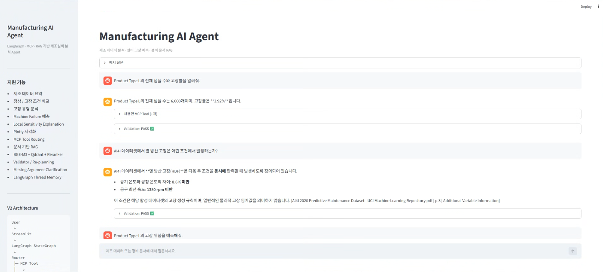
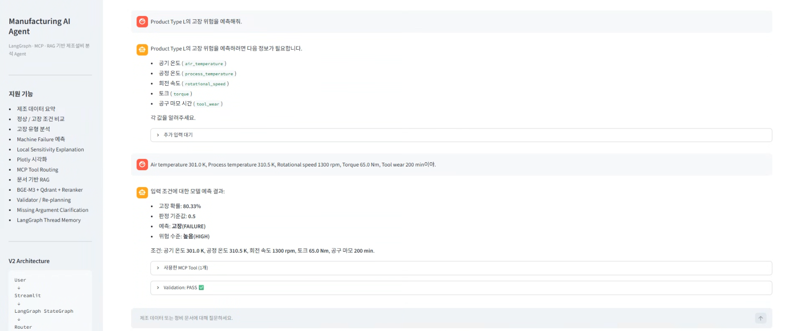
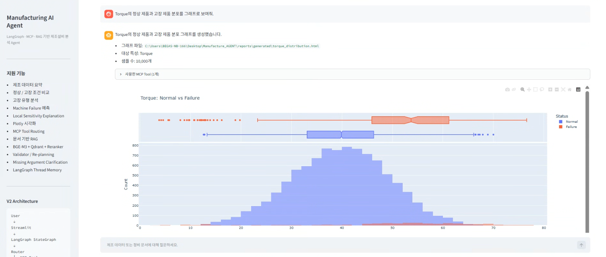
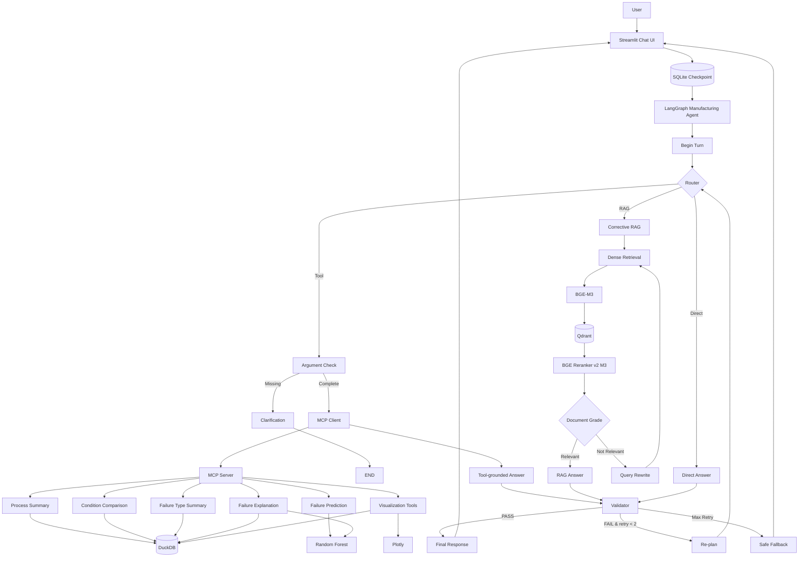

# Manufacturing AI Agent

> **LangGraph-based Manufacturing AI Agent with MCP Tools, Corrective RAG, Validation, and Durable Memory**

**Python 3.12 · LangGraph · MCP · OpenAI API · BGE-M3 · Qdrant · BGE Reranker · DuckDB · Random Forest · Streamlit · SQLite**

제조 데이터를 자연어로 조회·분석하고, 설비 고장 위험을 예측하며,  
예측 근거와 공정 조건을 설명·시각화하는 **Tool-using Manufacturing AI Agent**입니다.

V1에서는 OpenAI Agents SDK와 MCP를 기반으로 Tool-using Agent를 구현했고,  
V2에서는 Agent orchestration을 **LangGraph**로 마이그레이션하고 **Corrective RAG, Validator/Re-plan, Missing Argument Clarification, Durable SQLite Checkpoint**를 추가했습니다.

---

# 1. Project Overview

제조 현장의 데이터 분석 업무는 일반적으로 다음 단계를 포함합니다.

- 공정 데이터 조회
- 정상 / 고장 조건 비교
- 세부 고장 유형 분석
- 설비 고장 위험 예측
- 주요 위험요인 분석
- 시각화
- 기술 문서 기반 질의응답
- 분석 결과 검증

본 프로젝트는 이러한 기능을 Python 분석 모듈과 Machine Learning Model로 구현하고,  
**MCP(Model Context Protocol)** 를 통해 LangGraph Agent가 사용할 수 있는 Tool로 제공합니다.

또한 제조·보전·안전 관련 문서에 대해서는 별도의 **RAG pipeline**을 구성해  
Tool 실행과 문서 근거 기반 답변을 하나의 Agent에서 처리합니다.

사용자는 SQL이나 Python 코드를 직접 작성하지 않고 자연어로 요청할 수 있습니다.

예:

```text
User
Product Type L의 전체 샘플 수와 고장률을 알려줘.

Agent
전체 샘플 수: 6,000건
고장 건수: 235건
고장률: 3.92%
```

특정 제조조건을 입력하면 실제 Random Forest Model을 호출해 고장 위험을 예측할 수 있습니다.

```text
User
Product Type L이고,
Air temperature 301.0 K,
Process temperature 310.5 K,
Rotational speed 1300 rpm,
Torque 65.0 Nm,
Tool wear 200 min일 때 고장 위험을 예측해줘.

Agent
Failure Probability: 80.33%
Prediction: FAILURE
Risk Level: HIGH
```

---

# 2. Demo

## 2.1 LangGraph V2: MCP Tool + RAG

Streamlit Chat UI에서 제조 데이터 분석과 문서 기반 질의응답을 모두 수행할 수 있습니다.



V2에서는 사용자 요청을 먼저 Router가 분류합니다.

```text
Tool
→ 제조 데이터 조회 / ML 예측 / 시각화

RAG
→ 제조·보전·안전 문서 기반 질의응답

Direct
→ 시스템 기능 설명 / 일반 대화
```

각 답변 아래에서 실제 MCP Tool 실행 내역과 Validation 결과를 확인할 수 있습니다.

---

## 2.2 Missing Argument Clarification + Durable Memory

고장 예측에 필요한 입력값이 부족하면 Agent가 값을 임의로 추정하지 않고  
누락된 항목만 사용자에게 요청합니다.



예:

```text
User
Product Type L의 고장 위험을 예측해줘.

Agent
다음 정보가 필요합니다.
- Air temperature
- Process temperature
- Rotational speed
- Torque
- Tool wear
```

이후 사용자가 나머지 값만 입력해도 이전 `Product Type L`을 재사용합니다.

```text
User
Air temperature 301.0 K,
Process temperature 310.5 K,
Rotational speed 1300 rpm,
Torque 65.0 Nm,
Tool wear 200 min이야.

Agent
Failure Probability: 80.33%
Prediction: FAILURE
Risk Level: HIGH
```

이 상태는 **LangGraph SQLite Checkpoint**에 저장되므로  
Streamlit / Python 프로세스를 종료했다가 다시 실행해도 동일한 `thread_id`를 사용하면 이전 pending context를 복원할 수 있습니다.

---

## 2.3 Interactive Manufacturing Visualization

자연어 시각화 요청에 따라 Plotly 기반 제조 데이터 그래프를 생성하고  
Streamlit Chat UI 내부에 직접 표시합니다.



예:

```text
User
Torque의 정상 제품과 고장 제품 분포를 그래프로 만들어줘.

Agent
→ feature_distribution_chart Tool 실행
→ Plotly HTML 생성
→ Streamlit UI에 렌더링
```

---

# 3. V1 → V2 Migration

## V1

```text
Streamlit
→ OpenAI Agents SDK
→ MCP Server
→ Python / DuckDB / ML Tools
→ Validator Agent
```

V1에서는 Tool-using Manufacturing Agent와 별도 Validator를 구현했습니다.

## V2

```text
Streamlit
→ LangGraph
   ├─ Router
   ├─ MCP Tool Route
   ├─ Corrective RAG Route
   ├─ Direct Route
   ├─ Missing Argument Check
   ├─ Validator
   ├─ Re-plan / Retry
   └─ Safe Fallback
→ SQLite Checkpoint
```

V2에서는 OpenAI Agents SDK에 의존하던 orchestration을 LangGraph 상태 그래프로 이전했습니다.

V1 코드는 비교 및 회귀 검증을 위해 repository에 일부 유지하지만,  
현재 Streamlit V2의 active orchestration은 **LangGraph**입니다.

---

# 4. System Architecture



핵심 실행 흐름:

```text
User
 ↓
Streamlit
 ↓
SQLite-backed LangGraph State
 ↓
Router
 ├─ Tool
 ├─ RAG
 └─ Direct
 ↓
Answer
 ↓
Validator
 ├─ PASS → Final Answer
 └─ FAIL → Feedback → Re-plan → Retry
                    └─ Max Retry → Safe Fallback
```

---

# 5. Dataset

## AI4I 2020 Predictive Maintenance Dataset

UCI Machine Learning Repository의  
**AI4I 2020 Predictive Maintenance Dataset**을 사용했습니다.

```text
Samples: 10,000
Columns: 14
Failure Samples: 339
Failure Rate: 3.39%
```

주요 Model Feature:

| Feature | Description |
|---|---|
| Type | Product Quality Type (L / M / H) |
| Air temperature | Air Temperature |
| Process temperature | Process Temperature |
| Rotational speed | Rotational Speed |
| Torque | Torque |
| Tool wear | Tool Wear |

예측 Target:

```text
Machine failure
```

`TWF`, `HDF`, `PWF`, `OSF`, `RNF`는 세부 고장 유형 Label이므로  
`Machine failure` 예측 Feature에서는 제외해 **Target Leakage**를 방지했습니다.

`UID`, `Product ID` 역시 Model Feature에서 제외했습니다.

---

# 6. Exploratory Data Analysis

정상 데이터와 고장 데이터의 주요 평균값:

| Feature | Normal Mean | Failure Mean |
|---|---:|---:|
| Air temperature | 299.97 | 300.89 |
| Process temperature | 310.00 | 310.29 |
| Rotational speed | 1540.26 | 1496.49 |
| Torque | 39.63 | 50.17 |
| Tool wear | 106.69 | 143.78 |

차이가 상대적으로 크게 나타난 변수:

```text
Torque
Tool wear
Rotational speed
```

단, 이는 **그룹 간 통계적 차이**이며 물리적 인과관계를 의미하지 않습니다.

---

# 7. Failure Prediction Model

설비 고장 여부를 예측하기 위해 **Random Forest Classifier**를 사용했습니다.

입력 Feature:

```text
Type
Air temperature
Process temperature
Rotational speed
Torque
Tool wear
```

불균형 데이터 대응:

```python
class_weight="balanced"
```

## Test Performance

| Metric | Score |
|---|---:|
| Accuracy | 0.9800 |
| Precision | 0.9118 |
| Recall | 0.4559 |
| F1 Score | 0.6078 |
| ROC-AUC | 0.9585 |
| PR-AUC | 0.7745 |

Confusion Matrix:

```text
[[1929    3]
 [  37   31]]
```

Accuracy와 Precision은 높지만 Failure Recall은 **0.4559**입니다.

따라서 실제 제조 현장 적용에서는 False Negative 비용을 고려한  
**Threshold Calibration / Cost-sensitive Optimization**이 필요합니다.

---

# 8. Local Failure Explanation

SHAP 대신  
**One-Feature-at-a-Time Perturbation 기반 Local Sensitivity Analysis**를 구현했습니다.

특정 입력에서 하나의 Feature만 동일 Product Type 정상 데이터의 중앙값으로 변경한 뒤  
고장 예측확률이 얼마나 변하는지 측정합니다.

예:

```text
Original Failure Probability
= 80.33%

Torque
65.0 → 39.7

Failure Probability
80.33% → 4.67%

Risk Impact
+75.66%p
```

주요 Risk Driver:

| Feature | Input | Normal Reference | Risk Impact |
|---|---:|---:|---:|
| Torque | 65.0 | 39.7 | +75.66%p |
| Tool wear | 200 | 107 | +51.00%p |
| Rotational speed | 1300 | 1508 | +29.00%p |

이 값은 **SHAP Value나 인과효과가 아닙니다.**

정상 Reference로 한 변수를 변경했을 때  
ML Model의 예측확률이 얼마나 변하는지를 나타내는 **Local Model Sensitivity**입니다.

---

# 9. MCP Tools

MCP Server를 통해 총 **8개의 제조 분석 Tool**을 제공합니다.

| MCP Tool | Purpose |
|---|---|
| `process_summary` | 전체 / Product Type별 제조 데이터 요약 |
| `compare_process_condition` | 정상 / 고장 조건 비교 |
| `failure_type_summary` | 세부 고장 유형별 발생 현황 |
| `predict_machine_failure` | Random Forest 기반 고장 예측 |
| `explain_machine_failure` | Local Sensitivity 기반 위험요인 분석 |
| `feature_distribution_chart` | Feature 정상 / 고장 분포 시각화 |
| `failure_rate_by_type_chart` | Product Type별 고장률 시각화 |
| `risk_driver_chart` | Local Risk Driver 시각화 |

V2에서는 OpenAI Agents SDK의 MCP wrapper 대신  
**MCP Python SDK를 직접 사용해 Tool discovery / invocation을 수행**합니다.

---

# 10. Corrective RAG

제조·보전·안전 관련 공식 문서를 대상으로 RAG pipeline을 구성했습니다.

## Knowledge Sources

- UCI AI4I 2020 Predictive Maintenance Dataset documentation
- NASA Reliability-Centered Maintenance Guide
- DOE Operations & Maintenance Best Practices
- NIST AMS 400-1
- OSHA Lockout/Tagout Fact Sheet

원본 PDF는 repository에 포함하지 않으며  
`knowledge/raw/` 아래에 사용자가 별도로 배치하도록 구성합니다.

## RAG Pipeline

```text
Question
 ↓
Query Preparation
 ↓
BGE-M3 Embedding
 ↓
Qdrant Dense Retrieval Top-15
 ↓
BGE Reranker v2 M3
 ↓
Top-5
 ↓
Document Relevance Grading
 ├─ Relevant → Answer Generation
 └─ Not Relevant → Query Rewrite → Retrieve Again
```

Query Rewrite 최대 횟수는 **2회**입니다.

답변은 검색된 문서만 근거로 생성하며 다음과 같은 citation을 사용합니다.

```text
[source | p.page | section]
```

AI4I 문서의 고장 생성 조건은 실제 제조 공정의 보편적 물리 임계값이 아니라  
**synthetic dataset generation rule**로 명시하도록 제한합니다.

---

# 11. RAG Retrieval Evaluation

사전 정의한 6개 Retrieval Evaluation Query를 사용했습니다.

## Dense Retrieval

| Metric | Result |
|---|---:|
| Hit@5 | 100% |
| Hit@10 | 100% |
| Hit@15 | 100% |
| MRR | 0.722 |

## Reranker

| Metric | Result |
|---|---:|
| Hit@1 | 100% |
| Hit@3 | 100% |
| Hit@5 | 100% |
| MRR | 1.000 |

> 위 수치는 **사전 정의한 6개 Retrieval Evaluation Query에 대한 결과**이며,  
> 일반적인 RAG 정확도가 100%라는 의미는 아닙니다.

---

# 12. Missing Argument Validation

예측 Tool은 다음 6개 입력을 필요로 합니다.

```text
product_type
air_temperature
process_temperature
rotational_speed
torque
tool_wear
```

입력이 부족하면 Tool을 실행하지 않습니다.

```text
Router
 ↓
Argument Check
 ├─ Complete → MCP Tool 실행
 └─ Missing → 사용자에게 누락값만 요청
```

예:

```text
User
Product Type L이고 Torque가 65인데 고장 위험을 예측해줘.

Agent
Air temperature,
Process temperature,
Rotational speed,
Tool wear 값이 추가로 필요합니다.
```

누락된 값을 임의 생성하지 않도록 설계했습니다.

---

# 13. Validator & Re-planning

Tool / RAG / Direct 답변은 LangGraph의 Validator Node에서 검증합니다.

주요 검증 기준:

```text
Grounding
Completeness
Safe Interpretation
Capability Boundary
```

예:

- Tool Result에 없는 제조 수치를 생성하지 않는가
- ML 예측을 실제 물리적 고장 사실로 표현하지 않는가
- Local Sensitivity를 SHAP 또는 인과효과로 과장하지 않는가
- RAG 답변이 검색 문서 근거를 벗어나지 않는가
- 구현되지 않은 OEE / takt / inventory / demand forecasting 기능을 주장하지 않는가

검증 흐름:

```text
Answer
 ↓
Validator
 ├─ PASS → END
 └─ FAIL
      ↓
   Feedback
      ↓
   Re-plan
      ↓
   Router
      ↓
   Answer Regeneration
```

재생성 시 이전 `validation_feedback`을 직접 답변 생성 Prompt에 전달해  
동일 오류를 반복하지 않도록 했습니다.

최대 Retry는 **2회**이며, 이후에도 검증에 실패하면 Safe Fallback으로 종료합니다.

---

# 14. Durable Multi-turn Memory

V2는 LangGraph의 **AsyncSqliteSaver**를 사용합니다.

```text
database/langgraph_checkpoints.sqlite
```

같은 `thread_id`를 사용하면:

```text
Turn 1
Product Type L의 고장 위험을 예측해줘.
→ 5개 입력값 추가 요청
→ Pending State SQLite 저장

Python / Streamlit 종료

Turn 2
나머지 5개 값만 입력
→ SQLite에서 Product Type L 복원
→ Prediction Tool 실행
```

실제 테스트에서 Python 프로세스와 Streamlit 서버를 완전히 재시작한 뒤에도  
이전 pending context가 복원되는 것을 확인했습니다.

현재 LangGraph state는 영속화되지만, Streamlit의 과거 Chat Bubble 자체는 별도 UI history persistence가 필요합니다.

---

# 15. Automated Agent Evaluation

V2 LangGraph Agent에 대해 사전 정의한 **6개 제조 Agent Evaluation Case**를 실행했습니다.

평가 범위:

```text
Process Summary
Normal / Failure Comparison
Failure Prediction
Prediction + Explanation
Missing Input Safety
Visualization
```

결과:

| Metric | Result |
|---|---:|
| Eval Cases | 6 |
| Passed Cases | 6 |
| Predefined Eval Pass Rate | 100% |
| Required Tool Success Rate | 100% |
| Forbidden Tool Compliance | 100% |
| Answer Pattern Success Rate | 100% |
| Validator / Clarification Success Rate | 100% |
| Tool Efficiency Rate | 100% |
| Average MCP Tool Calls | 0.83 |

> 위 결과는 **사전 정의한 6개 제조 Agent Evaluation Case에서 6/6을 통과했다는 의미**이며,  
> 전체 Agent 정확도가 100%라는 의미는 아닙니다.

---

# 16. Streamlit Application

Streamlit 기반 Chat UI에서 다음 기능을 확인할 수 있습니다.

```text
Natural Language Query
Manufacturing Data Analysis
Failure Prediction
Local Risk Explanation
Corrective RAG
MCP Tool Trace
Missing Argument Clarification
Interactive Plotly Visualization
Validation Result
Durable LangGraph Memory
```

각 답변에서 실제 Tool 실행과 Validation 결과를 확인할 수 있습니다.

---

# 17. Tech Stack

| Category | Technology |
|---|---|
| Language | Python 3.12 |
| Agent Orchestration | LangGraph 0.6.11 |
| LLM API | OpenAI Python SDK |
| Tool Protocol | MCP |
| Embedding | BAAI/bge-m3 |
| Vector DB | Qdrant Local Mode |
| Reranker | BAAI/bge-reranker-v2-m3 |
| Document Parsing | pypdf |
| Data Processing | pandas / NumPy |
| Analytics Database | DuckDB |
| Machine Learning | scikit-learn |
| Prediction Model | Random Forest |
| Visualization | Plotly |
| Durable Memory | LangGraph AsyncSqliteSaver / SQLite |
| Evaluation | Custom Eval Harness |
| UI | Streamlit |
| Version Control | Git / GitHub |

V1 compatibility를 위해 OpenAI Agents SDK 관련 코드와 dependency 일부는 repository에 유지합니다.

---

# 18. Project Structure

```text
manufacturing-ai-agent/
│
├── agent/
│   └── ...                         # V1 Agents SDK implementation
│
├── app/
│   └── streamlit_app.py            # LangGraph V2 Streamlit UI
│
├── data/
│   └── .gitkeep
│
├── database/
│   └── .gitkeep
│
├── docs/
│   └── images/
│       ├── 01_streamlit_langgraph_v2_tool_rag.png
│       ├── 02_durable_memory_prediction_flow.png
│       └── 03_torque_distribution_visualization.png
│
├── evals/
│   ├── eval_cases.py
│   ├── run_evals.py                # V1 Eval
│   ├── rag_eval_cases.py
│   ├── run_rag_evals.py
│   ├── run_v2_evals.py
│   └── results/
│
├── graph/
│   ├── state.py
│   ├── rag_graph.py
│   ├── manufacturing_state.py
│   ├── mcp_client.py
│   ├── manufacturing_graph.py
│   ├── persistent_graph.py
│   ├── test_manufacturing_routes.py
│   ├── test_memory_flow.py
│   ├── test_replan_flow.py
│   └── test_sqlite_memory.py
│
├── knowledge/
│   └── raw/
│       └── README.md
│
├── mcp_server/
│   ├── server.py
│   └── test_server.py
│
├── rag/
│   ├── document_loader.py
│   ├── chunker.py
│   ├── embeddings.py
│   ├── vector_store.py
│   ├── ingest.py
│   ├── retriever.py
│   ├── qdrant_retriever.py
│   ├── reranker.py
│   └── ...
│
├── models/
│   └── .gitkeep
│
├── reports/
│   ├── figures/
│   └── generated/
│
├── src/
│   ├── download_data.py
│   ├── eda.py
│   ├── setup_database.py
│   ├── analysis_tools.py
│   ├── train_model.py
│   ├── prediction_tool.py
│   ├── explanation_tool.py
│   └── visualization_tool.py
│
├── .env.example
├── .gitignore
├── requirements.txt
├── requirements-lock.txt
├── README.md
└── setup_project.py
```

Runtime에서 생성되며 Git Repository에 포함하지 않는 파일:

```text
data/*.csv
database/qdrant/
database/langgraph_checkpoints.sqlite*
database/streamlit_session.json
database/*.duckdb
models/*.pkl
models/*.joblib
reports/generated/*.html
evals/results/*.json
evals/results/*.csv
knowledge/raw/*.pdf
```

---

# 19. Installation

## 19.1 Repository Clone

```bash
git clone https://github.com/dogsa33/manufacturing-ai-agent.git
cd manufacturing-ai-agent
```

## 19.2 Virtual Environment

Windows PowerShell:

```powershell
py -3.12 -m venv .venv
.\.venv\Scripts\Activate.ps1
```

## 19.3 Dependencies

```powershell
python -m pip install -r requirements.txt
```

`requirements-lock.txt`에는 개발 및 검증 당시의 전체 Python environment snapshot을 보존합니다.

주요 compatibility pin:

```text
pandas==2.2.3
scikit-learn==1.5.2
langgraph==0.6.11
langgraph-checkpoint-sqlite==3.0.1
aiosqlite==0.21.0
```

## 19.4 OpenAI API Key

`.env.example`:

```env
OPENAI_API_KEY=your_openai_api_key_here
OPENAI_MODEL=gpt-5.6-luna
```

실제 `.env` 파일:

```env
OPENAI_API_KEY=YOUR_API_KEY
OPENAI_MODEL=gpt-5.6-luna
```

실제 API Key는 Git Repository에 포함하지 않습니다.

---

# 20. Data / Model Setup

Dataset 다운로드, DuckDB 생성, Random Forest 학습:

```powershell
python setup_project.py
```

개별 실행:

```powershell
python -m src.download_data
python -m src.setup_database
python -m src.eda
python -m src.train_model
```

---

# 21. RAG Setup

공식 PDF 문서를 `knowledge/raw/`에 배치한 뒤 ingestion을 실행합니다.

```powershell
python -m rag.ingest
```

RAG pipeline은:

```text
PDF Loading
→ Section-aware Chunking
→ BGE-M3 Embedding
→ Qdrant Storage
```

순서로 구축됩니다.

Local Qdrant data는 Git Repository에 포함하지 않습니다.

---

# 22. Run Tests & Evaluations

## MCP Tool Test

```powershell
python -m mcp_server.test_server
```

## LangGraph Route Regression

```powershell
python -m graph.test_manufacturing_routes
```

## Multi-turn Memory

```powershell
python -m graph.test_memory_flow
```

## Validator / Re-plan / Safe Fallback

```powershell
python -m graph.test_replan_flow
```

## SQLite Durable Memory

```powershell
python -m graph.test_sqlite_memory phase1
python -m graph.test_sqlite_memory phase2
```

## RAG Retrieval Evaluation

```powershell
python -m evals.run_rag_evals
```

## LangGraph V2 Agent Evaluation

```powershell
python -m evals.run_v2_evals
```

V1 비교용 Eval:

```powershell
python -m evals.run_evals
```

---

# 23. Run Streamlit Application

```powershell
python -m streamlit run .\app\streamlit_app.py
```

`.streamlit/config.toml`:

```toml
[server]
fileWatcherType = "none"
```

기본 Local URL:

```text
http://localhost:8501
```

---

# 24. Design Principles

본 프로젝트에서는 LLM과 계산 / 검색 모듈의 역할을 분리했습니다.

```text
LLM / LangGraph
→ User Intent Understanding
→ Routing
→ Tool Selection
→ Clarification
→ Answer Synthesis
→ Validation / Re-planning

Python / ML / Retrieval
→ Data Query
→ Statistics
→ Prediction
→ Local Sensitivity
→ Visualization
→ Document Retrieval
→ Reranking
```

LLM이 제조 수치를 임의 생성하지 않고  
**MCP Tool Result 또는 검색 문서 근거를 사용**하도록 설계했습니다.

또한 Agent의 자율성을 무제한으로 높이는 대신:

```text
Tool Allow-list
Required Argument Validation
Document Grounding
Validator
Retry Limit
Safe Fallback
Durable State
Automated Evaluation
```

을 적용해 **Controlled Autonomy**를 지향했습니다.

---

# 25. Limitations

## 1. Failure Recall

현재 Random Forest의 Failure Recall은:

```text
0.4559
```

입니다.

실제 고장 Sample 중 일부를 놓치므로  
False Negative 감소를 위한 Threshold Optimization 또는 Cost-sensitive Learning이 필요합니다.

## 2. Explanation Method

현재 Local Explanation은 SHAP 기반 Feature Attribution이 아니라  
**One-Feature-at-a-Time Perturbation** 방식입니다.

따라서 Feature Contribution의 합산이나 인과적 해석에는 사용할 수 없습니다.

## 3. Small Evaluation Set

현재 Agent Eval과 Retrieval Eval 모두 각각 **6개의 사전 정의 Case / Query**를 기반으로 합니다.

보다 신뢰도 높은 평가를 위해서는 Eval Dataset 확대와 Adversarial Query 추가가 필요합니다.

## 4. Public Dataset PoC

현재 프로젝트는 공개 제조 Dataset을 기반으로 한 PoC입니다.

```text
Real-time Sensor Stream
MES
SCADA
PLC
Equipment Log
```

등의 실제 제조 시스템 연동은 포함하지 않습니다.

## 5. RAG Scope

현재 RAG는 사전에 구축한 5개 공식 문서 corpus에 한정됩니다.

검색 문서에 없는 정보는 답변 근거로 사용하지 않도록 설계했습니다.

## 6. UI History Persistence

LangGraph state와 pending context는 SQLite에 저장되지만  
Streamlit 서버 재시작 후 이전 Chat Bubble 전체를 다시 렌더링하는 UI history persistence는 아직 별도 구현 대상입니다.

---

# 26. Future Work

```text
Threshold Optimization
Cost-sensitive Failure Detection
Expanded Agent Evaluation Dataset
Adversarial Agent Evaluation
Chat UI History Persistence
Production-grade Checkpoint / DB
Persistent MCP Session Optimization
Real-time Equipment Data Integration
MES / SCADA Integration
Time-series Sensor Monitoring
Human Approval for High-risk Actions
Production Observability
Docker Containerization
```

---

# 27. Project Goal

이 프로젝트의 목표는 단순히 Machine Learning Model의 성능을 높이는 것이 아닙니다.

> **제조공정 문제를 Data와 Tool로 구조화하고,  
> LLM Agent가 데이터·모델·기술문서를 신뢰성 있게 활용할 수 있는  
> Manufacturing AI Agent Architecture를 구현하는 것**

핵심 구성:

```text
Manufacturing Domain
        +
Data Analytics
        +
Machine Learning
        +
MCP Tool Architecture
        +
Corrective RAG
        +
LangGraph Orchestration
        +
Validation / Evaluation
        +
Durable State
```

단순 Chatbot이 아니라  
**제조 데이터를 실제로 조회·분석·예측하고, 문서를 검색하며, 실행 결과를 검증하고, 실패 시 재계획할 수 있는 Manufacturing AI Agent** 구현을 목표로 했습니다.
