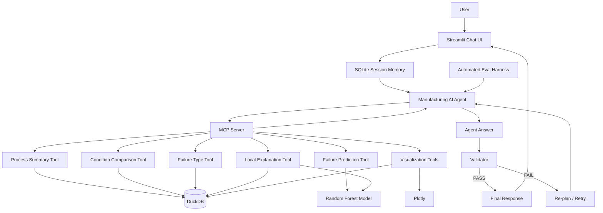

# Manufacturing AI Agent

> MCP 기반 제조설비 예지보전 및 원인분석 AI Agent

제조 데이터를 자연어로 분석하고, 설비 고장 위험을 예측하며,
예측 근거를 설명하고 시각화하는 Tool-using AI Agent 프로젝트입니다.

단순 LLM 질의응답이 아니라 제조 분석 기능을 MCP Tool로 분리하고,
Agent가 사용자의 요청에 따라 적절한 Tool을 선택하도록 설계했습니다.

또한 Validator, Re-planning, Session Memory, Automated Evaluation을 적용하여
Agent의 신뢰성과 실행 과정을 검증할 수 있도록 구성했습니다.

---

## 1. Project Overview

제조 현장에서 데이터 분석을 수행하려면 일반적으로 다음과 같은 작업이 필요합니다.

- 공정 데이터 조회
- 정상 / 고장 조건 비교
- 설비 고장 위험 예측
- 위험 원인 분석
- 시각화
- 분석 결과 검증

본 프로젝트는 이러한 기능을 Python 함수로 구현한 뒤,
MCP(Model Context Protocol)를 통해 LLM Agent가 사용할 수 있는 Tool로 제공합니다.

사용자는 SQL이나 Python 코드를 작성하지 않고 자연어만으로 제조 데이터를 분석할 수 있습니다.

예시:

```text
User:
Product Type L의 전체 샘플 수와 고장률을 알려줘.

Agent:
전체 샘플 수: 6,000건
고장 건수: 235건
고장률: 3.92%
```

또는:

```text
User:
Type L이고 Air temperature 301,
Process temperature 310.5,
Rotational speed 1300,
Torque 65,
Tool wear 200일 때 고장 위험을 분석해줘.
```

Agent는 고장 예측 Tool을 호출하여 실제 ML 모델의 결과를 사용합니다.

```text
Failure Probability: 80.33%
Risk Level: HIGH
```

---

## 2. System Architecture



핵심 구조는 다음과 같습니다.

```text
User
 ↓
Streamlit
 ↓
Session Memory
 ↓
LLM Agent
 ↓
MCP Tool Selection
 ↓
DuckDB / ML / Visualization
 ↓
Tool Observation
 ↓
Agent Answer
 ↓
Validator
 ├─ PASS → Final Answer
 └─ FAIL → Re-plan → Retry
```

---

## 3. Dataset

### AI4I 2020 Predictive Maintenance Dataset

UCI Machine Learning Repository의
AI4I 2020 Predictive Maintenance Dataset을 사용했습니다.

데이터 규모:

```text
Samples: 10,000
Columns: 14
```

주요 입력 변수:

| Feature | Description |
|---|---|
| Type | Product Quality Type (L/M/H) |
| Air temperature | Air Temperature |
| Process temperature | Process Temperature |
| Rotational speed | Rotational Speed |
| Torque | Torque |
| Tool wear | Tool Wear |

예측 Target:

```text
Machine failure
```

전체 데이터의 고장 비율은 약 3.39%로 불균형 데이터입니다.

```text
Normal : 9,661
Failure:   339
```

TWF, HDF, PWF, OSF, RNF는 고장 유형 Label이므로
Machine Failure 예측 Feature에서는 제외하여 Target Leakage를 방지했습니다.

---

## 4. Exploratory Data Analysis

정상 데이터와 고장 데이터를 비교한 결과 주요 평균값은 다음과 같습니다.

| Feature | Normal Mean | Failure Mean |
|---|---:|---:|
| Air temperature | 299.97 | 300.89 |
| Process temperature | 310.00 | 310.29 |
| Rotational speed | 1540.26 | 1496.49 |
| Torque | 39.63 | 50.17 |
| Tool wear | 106.69 | 143.78 |

특히 Torque와 Tool wear에서 정상 / 고장 그룹 간 차이가 크게 나타났습니다.

단, 이는 그룹 간 통계적 차이이며 인과관계를 의미하지 않습니다.

---

## 5. Failure Prediction Model

설비 고장 여부를 예측하기 위해 Random Forest Classifier를 사용했습니다.

입력 Feature:

```text
Type
Air temperature
Process temperature
Rotational speed
Torque
Tool wear
```

불균형 데이터를 고려하기 위해:

```python
class_weight="balanced"
```

를 적용했습니다.

### Test Performance

| Metric | Score |
|---|---:|
| Accuracy | 0.9800 |
| Precision | 0.9118 |
| Recall | 0.4559 |
| F1 Score | 0.6078 |
| ROC-AUC | 0.9585 |
| PR-AUC | 0.7745 |

Confusion Matrix:

```text
[[1929    3]
 [  37   31]]
```

Accuracy는 높지만 Failure Recall이 0.4559이므로
실제 고장 샘플 중 일부를 놓치는 한계가 있습니다.

따라서 실제 제조 시스템 적용 시에는
False Negative 비용을 고려한 Threshold Calibration이 필요합니다.

---

## 6. Local Failure Explanation

SHAP 대신 One-Feature-at-a-Time Perturbation 기반
Local Sensitivity Analysis를 구현했습니다.

특정 입력값에서 하나의 Feature만
동일 Product Type 정상 데이터의 중앙값으로 변경한 후,
고장 예측확률의 변화를 측정합니다.

예:

```text
Input Condition

Type = L
Torque = 65
Tool wear = 200
Rotational speed = 1300

Original Failure Probability
= 80.33%
```

Torque를 정상 중앙값으로 변경:

```text
Torque
65.0 → 39.7

Failure Probability
80.33% → 4.67%

Risk Impact
+75.66%p
```

동일 방식으로 계산한 주요 Risk Driver:

| Feature | Risk Impact |
|---|---:|
| Torque | +75.66%p |
| Tool wear | +51.00%p |
| Rotational speed | +29.00%p |

이 수치는 SHAP Value나 인과효과가 아닙니다.

모델의 Local Sensitivity를 나타냅니다.

---

## 7. MCP Tools

제조 분석 기능을 MCP Server를 통해 총 8개의 Tool로 제공합니다.

| MCP Tool | Purpose |
|---|---|
| `process_summary` | 전체 / Product Type별 제조 데이터 요약 |
| `compare_process_condition` | 정상 / 고장 조건 비교 |
| `failure_type_summary` | 고장 유형별 발생 현황 |
| `predict_machine_failure` | Random Forest 기반 고장 예측 |
| `explain_machine_failure` | Local Sensitivity 기반 위험요인 분석 |
| `feature_distribution_chart` | Feature 정상 / 고장 분포 시각화 |
| `failure_rate_by_type_chart` | Product Type별 고장률 시각화 |
| `risk_driver_chart` | Risk Driver 시각화 |

Agent는 사용자의 자연어 요청을 분석하여 필요한 MCP Tool을 자동 선택합니다.

예:

```text
User
"Torque가 정상과 고장에서 어떻게 달라?"

          ↓

Agent

          ↓

compare_process_condition(
    feature="Torque"
)
```

---

## 8. Multi-Tool Agent

복합 요청에서는 여러 Tool을 연속 호출할 수 있습니다.

예:

```text
User
"고장 위험을 예측하고 왜 위험한지도 설명해줘."
```

Agent 실행:

```text
1. predict_machine_failure

2. explain_machine_failure

3. Tool Observation

4. Final Answer
```

LLM이 제조 관련 수치를 직접 생성하지 않고,
Python Tool이 계산한 결과를 기반으로 답변하도록 설계했습니다.

---

## 9. Validator & Re-planning Harness

Main Agent의 답변을 별도 Validator Agent가 검증합니다.

Validator 평가 항목:

```text
Grounded
Complete
Safe Interpretation
```

검증 흐름:

```text
Main Agent
 ↓
MCP Tools
 ↓
Answer
 ↓
Validator
 ├─ PASS
 │    ↓
 │  Final
 │
 └─ FAIL
      ↓
   Feedback
      ↓
   Re-plan
      ↓
   Agent Retry
```

최대 Retry 횟수를 제한하여 무한 반복을 방지합니다.

또한 Random Forest 결과를 실제 고장의 확정 판정처럼 표현하거나,
Local Sensitivity를 인과관계처럼 해석하지 않는지 검증합니다.

---

## 10. Persistent Session Memory

SQLite 기반 Session Memory를 적용했습니다.

예:

```text
User
Type L, Torque 65, Tool wear 200 ... 고장 위험을 예측해줘.

Agent
고장확률은 80.33%입니다.

User
그럼 왜 위험해?

Agent
Torque, Tool wear, Rotational speed가
주요 Risk Driver입니다.
```

두 번째 질문에서는 제조조건을 다시 입력하지 않았지만,
이전 Conversation Context를 활용해 적절한 Tool을 호출할 수 있습니다.

```text
database/agent_sessions.db
```

는 Runtime 파일이며 Git Repository에는 포함하지 않습니다.

---

## 11. Automated Evaluation Harness

Agent 동작을 자동 검증하기 위한 Eval Harness를 구현했습니다.

평가 항목:

```text
Required Tool Selection
Forbidden Tool Compliance
Answer Fact Accuracy
Validator Pass Rate
Tool Efficiency
Missing-input Safety
```

현재 구축한 6개 Regression Eval Case 결과:

| Metric | Result |
|---|---:|
| Eval Cases | 6 |
| Passed Cases | 6 |
| Overall Pass Rate | 100% |
| Required Tool Accuracy | 100% |
| Forbidden Tool Compliance | 100% |
| Answer Fact Accuracy | 100% |
| Validator Pass Rate | 100% |
| Tool Efficiency Rate | 100% |
| Average Tool Calls | 1.17 |

이 수치는 제한된 6개의 사전 정의 Eval Case에 대한 결과이며,
일반적인 Agent 정확도 100%를 의미하지 않습니다.

향후 Eval Dataset을 확장하여
더 다양한 Failure Case와 Adversarial Query를 검증할 수 있습니다.

---

## 12. Streamlit Application

Streamlit 기반 Chat UI를 제공합니다.

UI에서 다음 기능을 확인할 수 있습니다.

```text
Natural Language Query
MCP Tool Trace
Manufacturing Analysis Result
Failure Prediction
Local Risk Explanation
Interactive Plotly Chart
Validation Result
Conversation Memory
```

각 응답에서 Agent가 실제 사용한 MCP Tool을 확인할 수 있어
기본적인 Agent Observability를 제공합니다.

예:

```text
Used MCP Tools

1. predict_machine_failure
2. explain_machine_failure
```

Validator 결과도 UI에서 확인할 수 있습니다.

```text
Validation: PASS

Attempts: 1
Grounded: True
Complete: True
Safe Interpretation: True
```

---

## 13. Tech Stack

| Category | Technology |
|---|---|
| Language | Python 3.12 |
| Agent | OpenAI Agents SDK |
| Tool Protocol | MCP |
| Data Analysis | pandas / NumPy |
| Database | DuckDB |
| ML | scikit-learn |
| Model | Random Forest |
| Visualization | Plotly |
| Session Memory | SQLite |
| Validation | Pydantic Structured Output |
| Evaluation | Custom Eval Harness |
| UI | Streamlit |
| Version Control | Git |

---

## 14. Project Structure

```text
Manufacture_AGENT/
│
├── agent/
│   ├── manufacturing_agent.py
│   ├── validated_agent.py
│   ├── ui_harness.py
│   ├── test_agent_tools.py
│   └── test_session_memory.py
│
├── app/
│   └── streamlit_app.py
│
├── data/
│
├── database/
│   └── manufacturing.duckdb
│
├── evals/
│   ├── eval_cases.py
│   ├── run_evals.py
│   └── results/
│
├── mcp_server/
│   ├── server.py
│   └── test_server.py
│
├── models/
│   └── failure_model.pkl
│
├── reports/
│   ├── figures/
│   └── generated/
│
├── src/
│   ├── download_data.py
│   ├── eda.py
│   ├── setup_database.py
│   ├── analysis_tools.py
│   ├── train_model.py
│   ├── prediction_tool.py
│   ├── explanation_tool.py
│   └── visualization_tool.py
│
├── .env.example
├── .gitignore
├── requirements.txt
└── README.md
```

---

## 15. Installation

### 1. Repository Clone

```bash
git clone <repository-url>
cd Manufacture_AGENT
```

### 2. Virtual Environment

Windows PowerShell:

```powershell
py -3.12 -m venv .venv
.\.venv\Scripts\Activate.ps1
```

### 3. Dependencies

```powershell
python -m pip install -r requirements.txt
```

### 4. OpenAI API Key

PowerShell:

```powershell
$env:OPENAI_API_KEY="YOUR_API_KEY"
```

API Key를 소스코드에 직접 저장하지 마세요.

---

## 16. Data / Model Setup

Dataset Download:

```powershell
python -m src.download_data
```

DuckDB 생성:

```powershell
python -m src.setup_database
```

EDA:

```powershell
python -m src.eda
```

ML Model Training:

```powershell
python -m src.train_model
```

---

## 17. Run MCP Test

```powershell
python -m mcp_server.test_server
```

MCP Tool Discovery와 Structured Output이 정상 작동하는지 확인할 수 있습니다.

---

## 18. Run Agent Evaluation

```powershell
python -m evals.run_evals
```

Eval 결과는 Runtime Report로 생성됩니다.

```text
evals/results/
```

---

## 19. Run Streamlit Application

```powershell
python -m streamlit run .\app\streamlit_app.py
```

기본 접속 주소:

```text
http://localhost:8501
```

---

## 20. Design Principles

본 프로젝트에서는 다음 원칙을 적용했습니다.

```text
LLM
→ Intent Understanding
→ Tool Selection
→ Explanation

Python / ML
→ Calculation
→ Statistics
→ Prediction
→ Visualization
```

즉 LLM이 제조 데이터의 수치를 직접 추측하지 않고,
결정론적인 Python Tool을 통해 필요한 값을 조회하도록 설계했습니다.

또한 Agent의 자율성을 무제한으로 높이는 대신:

```text
Tool Allow-list
Structured Output
Validator
Retry Limit
Evaluation
```

을 통해 Controlled Autonomy를 지향했습니다.

---

## 21. Limitations

현재 프로젝트의 주요 한계는 다음과 같습니다.

현재 ML Model의 Failure Recall은 0.4559로,
False Negative 개선이 필요합니다.

Local Explanation은 SHAP 기반 Feature Attribution이 아니라
One-Feature-at-a-Time Perturbation 방식입니다.

현재 Eval Dataset은 6개 Regression Case로 제한적입니다.

단일 공개 Dataset 기반 PoC이며,
실제 제조설비의 Time-series Sensor Stream이나
실시간 MES / SCADA 연동은 포함하지 않습니다.

현재 Agent는 단일 Main Agent + Validator 구조이며,
불필요한 Multi-Agent Complexity는 적용하지 않았습니다.

---

## 22. Future Work

향후 다음 방향으로 확장할 수 있습니다.

```text
Threshold Optimization
Cost-sensitive Failure Detection
Time-series Sensor Monitoring
Real-time Equipment Data Integration
SOP / Manual RAG
MCP Streamable HTTP Deployment
Expanded Agent Evaluation Dataset
Human Approval for High-risk Actions
Durable Workflow / Checkpoint
Production Observability
```

---

## 23. Project Goal

이 프로젝트의 목표는 단순히 ML 모델 성능을 높이는 것이 아니라,

> 제조공정 문제를 데이터와 Tool로 구조화하고,
> LLM Agent가 이를 신뢰성 있게 활용할 수 있는
> Manufacturing AI Agent Architecture를 구현하는 것

입니다.